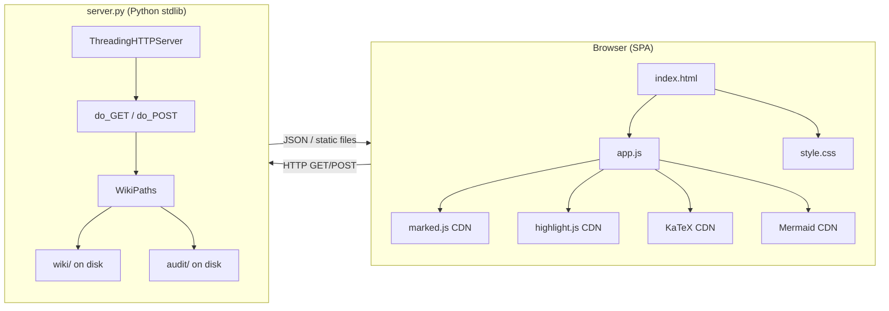
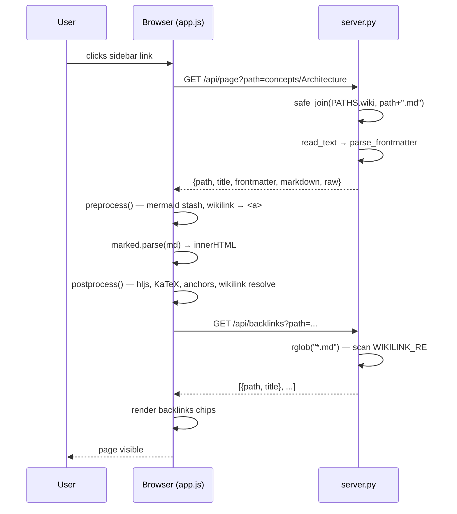

# Architecture

llm-wiki-viewer is a four-file application: a Python stdlib HTTP server and a vanilla-JS single-page application. There is no build step, no package manager, and no server-side templating.

## System diagram

## File roles

| File | Role |
|------|------|
| `server.py` | Serves static assets (index.html, app.js, style.css) and handles all `/api/*` routes. Reads markdown from disk on every request — no cache. |
| `index.html` | SPA shell. Loads CDN scripts and links. Contains all DOM structure. |
| `app.js` | All client logic: state management, routing, rendering, search, audit, backlinks. |
| `style.css` | Design tokens (CSS custom properties), light/dark themes, all component styles. |

## Request lifecycle

## Path safety

`safe_join(base, rel)` calls `.resolve()` on the joined path and checks that the result is still under `base`. Any path that escapes the wiki root (e.g. `../../etc/passwd`) returns `None` and results in a 404. All file reads in `do_GET` go through this function.

## Threading model

`ThreadingHTTPServer` handles each HTTP request in its own thread. The Python GIL means concurrent wiki reads are safe (reads are pure I/O). Audit writes go to uniquely-named files (timestamp + UUID hex), so concurrent POSTs to `/api/audit` cannot collide.

## No-build philosophy

CDN deps are loaded at runtime from `cdn.jsdelivr.net`. This means:
- Zero install: `python server.py` is the entire setup.
- The app works offline only if the CDN assets are browser-cached.
- CDN versions are pinned (e.g. `marked@12.0.2`) to avoid silent breakage.

See [[Configuration]] for `.viewer.json` customization options.
