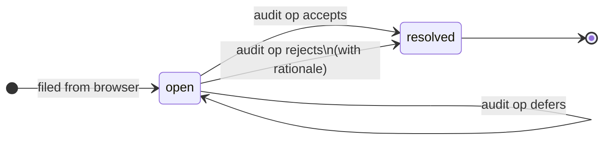

# Audit Feedback Workflow

The audit feedback system closes the loop between human readers and the AI-maintained wiki. Readers file comments in the browser; the llm-wiki `audit` operation processes them and moves them to `resolved/`.

## Filing feedback (browser side)

See [[Audit Feedback System]] for the selection → toolbar → modal → POST mechanics. In brief:

1. Select any prose text in an article
2. Click "Add feedback" in the floating toolbar
3. Choose severity, enter name and comment, click "File feedback"
4. A structured `.md` file is written to `audit/`

## Audit file anatomy

```
audit/20260516-143022-threading-model.md
```

Filename: `YYYYMMDD-HHMMSS-<slug>.md` where slug is derived from the comment text. This gives a unique, sortable, human-readable name with no UUID collisions.

The file structure:

```markdown
---
id: 20260516-143022-a1b2         ← timestamp + 4-char hex
target: wiki/concepts/Architecture.md
target_lines: [42, 42]           ← approximate; may drift after edits
anchor_before: "...80 chars..."  ← JSON-encoded string
anchor_text: "ThreadingHTTPServer"
anchor_after: "...80 chars..."
severity: warn
author: "justin"
source: web-viewer
created: 2026-05-16T14:30:22+00:00
status: open
---

# Comment

Should note the GIL caveat — CPU-bound handlers would block the thread pool.

# Resolution

<!-- Filled in when the audit is processed and moved to resolved/ -->
```

## Processing with llm-wiki audit op

Run the review script to see open items:

```bash
python3 /path/to/llm-wiki-skill/scripts/audit_review.py /path/to/wiki-root --open
```

For each open audit, the AI:
1. Reads the audit file
2. Uses `anchor_before` / `anchor_text` / `anchor_after` to locate the range in the target file (line numbers may have drifted)
3. Decides: accept, partially accept, reject, or defer
4. Applies any corrections to the target wiki page
5. Appends a `# Resolution` section to the audit file
6. Moves the file to `audit/resolved/`
7. Logs the resolution in `log/YYYYMMDD.md`

## Viewing the inbox

The viewer's feedback inbox (opened via "inbox" in the sidebar footer) shows all `audit/*.md` files. It does **not** show `audit/resolved/` — those are archived.



Rejected audits are **not deleted** — they move to `resolved/` with the rejection rationale documented. This preserves the feedback history and prevents the same incorrect feedback from being re-filed.

## Severity semantics

| Severity | Intent | Typical action |
|----------|--------|----------------|
| `info` | Neutral context, additional detail | May enrich the page |
| `suggest` | Potential improvement | Apply if it fits |
| `warn` | Likely inaccuracy | Verify and correct |
| `error` | Definite mistake | Fix immediately |

## Keeping the wiki current

As the llm-wiki-viewer project evolves (new features, API changes, refactors), wiki pages can go stale. The preferred pattern:

1. Make code changes
2. Run the viewer, browse the affected wiki pages
3. File `warn`/`error` feedback on any stale content
4. Run `audit` op to apply corrections
5. Update `CLAUDE.md` article list and `updated:` frontmatter
