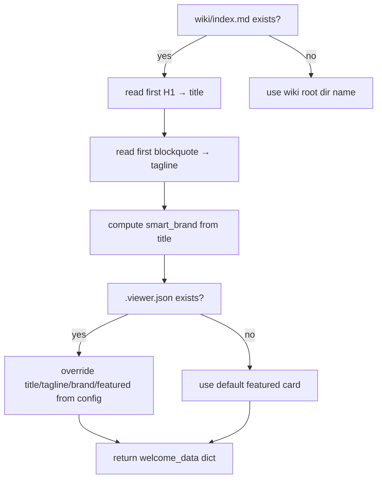

# Configuration

The viewer has two configuration surfaces: command-line arguments (or environment variables) for the server, and an optional `.viewer.json` file at the wiki root for the welcome screen.

## Server configuration

| Argument | Env var | Default | Description |
|----------|---------|---------|-------------|
| `wiki_root` (positional) | `LWV_WIKI_ROOT` | `cwd` | Path to the wiki root directory |
| `--port` | `LWV_PORT` | `8765` | TCP port to bind |
| `--host` | `LWV_HOST` | `0.0.0.0` | Interface to bind (`0.0.0.0` = LAN-accessible) |
| `--no-open` | — | false | Skip auto-opening browser tab |

The server prints a startup banner with the local URL and (if host is `0.0.0.0`) the LAN IP address.

## `.viewer.json`

An optional file at `WIKI_ROOT/.viewer.json` customizes the welcome screen. All fields are optional.

```json
{
  "title":   "My Wiki",
  "tagline": "One paragraph description shown below the title.",
  "brand":   "MW",
  "featured": [
    {
      "tag":   "Start here",
      "title": "Index",
      "blurb": "The full catalog of pages.",
      "path":  "index"
    },
    {
      "tag":   "Synthesis",
      "title": "Architecture",
      "blurb": "How the four files fit together.",
      "path":  "concepts/Architecture"
    }
  ]
}
```

### Field details

**`title`** — displayed as the page `<title>`, the welcome screen H1, and the sidebar brand. If omitted, auto-detected from the first `# H1` in `wiki/index.md` (stripping the `"Index — "` prefix pattern).

**`tagline`** — shown below the title on the welcome screen. If omitted, auto-detected from the first blockquote in `wiki/index.md`.

**`brand`** — short sidebar label (≤ 14 chars). If omitted, derived from `title` by `smart_brand()`: initials of capitalized words (up to 4 chars) if there are ≥ 2, otherwise first two words.

**`featured`** — array of welcome-screen cards. Each card can have:
- `tag` — small uppercase chip at the top of the card
- `title` — card heading
- `blurb` — one-sentence description
- `path` — wiki path to navigate to on click (no `.md` extension)

An empty array hides the card grid entirely. Omitting the field shows a single default "Open the index" card.

## Auto-detection fallback

`welcome_data()` in `server.py` tries auto-detection before applying `.viewer.json` overrides:



## Validation

The server validates the wiki root on startup:
- The path must exist
- It must contain a `wiki/` subdirectory

If either check fails, the server exits with an error rather than starting in a broken state. The `audit/` directory is created on-demand when the first audit is filed.
