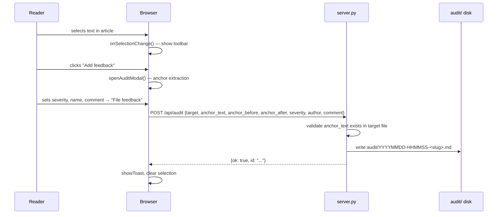
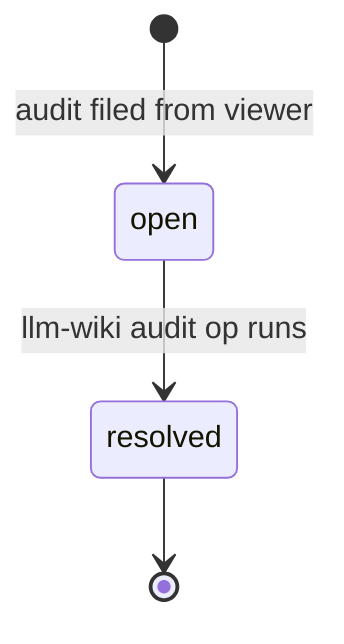

# Audit Feedback System

The audit feedback system lets readers file structured comments on any piece of text directly from the browser. Comments are written as markdown files to `audit/` where the llm-wiki `audit` operation can process them.

## End-to-end flow



## Selection detection

`onSelectionChange()` fires on `mouseup` and `shift+keyup`. It checks that:
1. A selection exists and is not collapsed
2. The selection's `commonAncestorContainer` is inside `els.article`
3. The selected text is ≥ 3 characters
4. The bounding rect is non-zero (guards against programmatic selections)

When all checks pass, the floating `.selection-toolbar` is positioned just above the selection using `getBoundingClientRect()` + `window.scrollY`.

## Anchor extraction

`openAuditModal()` locates the selected text in `state.currentRaw` (the original markdown, not the rendered HTML). This is important because the AI processes the raw markdown, not the rendered output.

Fuzzy fallback: if the literal text isn't found in raw, whitespace is normalized on both sides and a secondary search is attempted.

```js
// anchor context window: 80 chars before and after
anchor_before = raw.slice(max(0, pos - 80), pos);
anchor_text   = raw.slice(pos, pos + matched.length);
anchor_after  = raw.slice(pos + matched.length, pos + matched.length + 80);
```

This 80-char context window lets the AI re-locate the anchor even if line numbers have drifted after edits.

## Audit file format

Files written to `audit/` follow the llm-wiki audit format:

```markdown
---
id: 20260516-143022-a1b2
target: wiki/concepts/Architecture.md
target_lines: [42, 42]
anchor_before: "...text before..."
anchor_text: "ThreadingHTTPServer"
anchor_after: "...text after..."
severity: warn
author: "justin"
source: web-viewer
created: 2026-05-16T14:30:22+00:00
status: open
---

# Comment

Should mention the GIL caveat for CPU-bound request handlers.

# Resolution

<!-- Filled in when the audit is processed and moved to resolved/ -->
```

## Feedback inbox

The inbox modal is opened via the "inbox" link in the sidebar footer. It fetches `/api/audits` on open and renders each audit as a card. Filter tabs: **Open** (status=open) | **All**.

Each card shows:
- Severity badge (color-coded: info/suggest/warn/error)
- Target page path (clickable — navigates to that page and closes inbox)
- Anchor text excerpt (monospace, truncated at 80 chars)
- Author and relative time
- First line of the comment



Resolved audits move to `audit/resolved/` with a `# Resolution` section appended. The inbox shows only `status: open` files by default; the "All" filter shows everything in `audit/` (not `audit/resolved/`).

## Severity levels

| Level | Meaning |
|-------|---------|
| `info` | Neutral note or context |
| `suggest` | Potential improvement |
| `warn` | Likely inaccuracy |
| `error` | Definite mistake |

See [[Audit Feedback Workflow]] for how the llm-wiki `audit` op processes these files.
