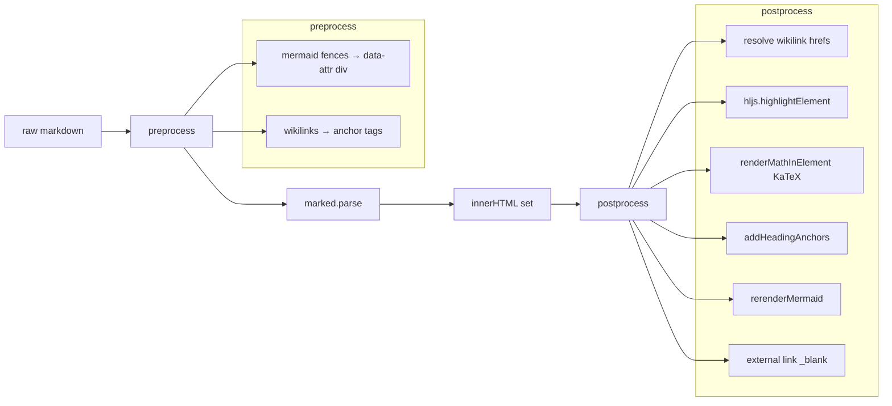

# Rendering Pipeline

Every page load goes through a four-stage pipeline: `preprocess → parse → highlight → postprocess`.



## Stage 1 — preprocess()

Runs on the raw markdown string before `marked.parse`.

**Mermaid stashing**: ` ```mermaid ` fences are converted to `<div class="mermaid" data-mermaid-source="...">` before marked sees them. This prevents marked from treating the mermaid syntax as code and mangling characters like `-->`. The source is stored in a `data-` attribute rather than inner text so HTML parsing by the browser doesn't corrupt it.

**Wikilink conversion**: `[[Page Name]]` and `[[Page Name|display text]]` are converted to `<a class="wikilink" data-target="Page Name" href="#">display text</a>`. The href is a placeholder; real hrefs are set in postprocess once the stem map is built.

## Stage 2 — marked.parse()

`marked.js` converts the preprocessed markdown to HTML, which is written to `els.article.innerHTML`. At this point wikilinks are `<a>` tags with `href="#"`, mermaid blocks are empty divs, math is still raw `$...$` text.

## Stage 3 — postprocess()

Runs after innerHTML is set. Five independent passes:

### Wikilink resolution

`resolveLink(target)` checks three levels:
1. Exact path match in `state.pathSet`
2. Stem match in `state.stemMap`
3. Last-component match (the filename, ignoring folder)

Resolved links get a real `href=?p=...` and a click handler. Unresolved links get class `broken` (red strikethrough) and the click is swallowed.

### Syntax highlighting

```js
if (window.hljs) {
  els.article.querySelectorAll("pre code").forEach(block => {
    hljs.highlightElement(block);
  });
}
```

`hljs.highlightElement` adds `class="hljs"` and language-specific token classes to the `<code>` element. The active [[Theming|hljs CSS theme]] (GitHub light or GitHub dark) provides the token colors.

### Math rendering (KaTeX)

`renderMathInElement` is loaded `defer` from CDN, so postprocess guards with `if (window.renderMathInElement)`. Delimiters: inline `$...$` and block `$$...$$`. `throwOnError: false` prevents a broken formula from crashing the page.

### Heading anchors

`addHeadingAnchors()` walks every `h1`–`h4`, generates a URL-friendly slug from `textContent`, sets the element's `id`, and appends a hidden `<a class="heading-anchor">` link icon. Duplicate slugs get a numeric suffix (`-2`, `-3`). Clicking the icon updates `location.hash` and calls `h.scrollIntoView({ behavior: "smooth" })`.

Slug algorithm:
```js
text.trim().toLowerCase()
  .replace(/[^\w\s-]/g, "")   // strip non-word chars
  .replace(/\s+/g, "-")        // spaces → dashes
  .replace(/-+/g, "-")         // collapse dashes
  .replace(/^-|-$/g, "")       // trim edges
```

### Mermaid rendering

`rerenderMermaid()` reads each `.mermaid` div's `data-mermaid-source` attribute, picks a theme (`dark` or `default`) based on the current data-theme, calls `mermaid.render()`, and replaces the div's innerHTML with the returned SVG. Errors show a styled error block with the raw source for debugging.

Re-runs on theme toggle so diagram colors stay consistent with the app theme.
