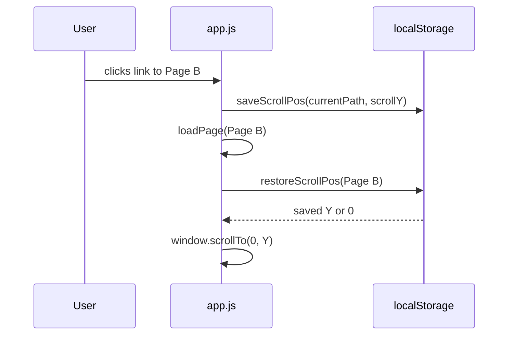

# Sidebar Navigation

The sidebar has four zones: header (brand + controls), search, file tree, and footer. On desktop it is a fixed 280px column; on mobile it collapses to a header strip with a hamburger toggle.

## File tree

The tree is built from the `/api/tree` response in `renderTree()`. Folder sort order is hardcoded: `concepts` → `entities` → `summaries` → alphabetical for anything else. Within folders, sub-folders appear before files.

### Collapsible folders

Each folder node is a `<div class="tree-folder">` containing a clickable `<div class="tree-folder-name">` label and a `<div class="tree-folder-inner">` content wrapper. Clicking the label toggles the class `tree-folder--collapsed` on the parent.

Collapsed state is persisted in `localStorage` as a JSON array of folder path keys (`lwv-collapsed`):

```js
let collapsedFolders = new Set(
  JSON.parse(localStorage.getItem("lwv-collapsed") || "[]")
);
```

The CSS hides content when collapsed:
```css
.tree-folder--collapsed .tree-folder-inner { display: none; }
```

A triangle `::before` pseudo-element on `.tree-folder-name` rotates 90° when collapsed, providing a visual caret. Deeply nested folders get `tree-nested` class for indentation + left border.

## Search

Full-text search fires on input with a 120ms debounce. Results are fetched from `/api/search?q=`. The search panel sits in an `position: absolute` dropdown anchored to the input.

### Match highlighting

Matched query text is wrapped in `<mark class="search-mark">` in search snippets:

```js
function highlightSnippet(snippet, q) {
  const escapedSnippet = escapeHtml(snippet);
  const escapedQ = escapeHtml(q).replace(/[.*+?^${}()|[\]\\]/g, "\\$&");
  return escapedSnippet.replace(new RegExp(escapedQ, "gi"),
    m => `<mark class="search-mark">${m}</mark>`);
}
```

Escaping order: HTML-escape first, then regex-escape the query, then replace in the already-escaped HTML string. This prevents XSS while correctly highlighting the term.

Keyboard navigation: ↑ / ↓ to move focus, Enter to navigate, Escape to dismiss. Ctrl+K focuses the search input from anywhere on the page.

## Scroll position memory

Scroll position is saved to `localStorage` (`lwv-scroll`) as `{ [path]: scrollY }` whenever a navigation away from a page occurs. When returning to a page, `restoreScrollPos(path)` is called after `renderPage()` finishes.



If no saved position exists (first visit), the page scrolls to top.

## Footer

The sidebar footer shows:
- **Page count** — total `.md` files in `wiki/`, counted while building the stem map
- **Author name** — click to set; persisted in `localStorage` as `lwv-author`; pre-fills the audit modal's name field
- **inbox** — opens the [[Audit Feedback System|feedback inbox modal]]
