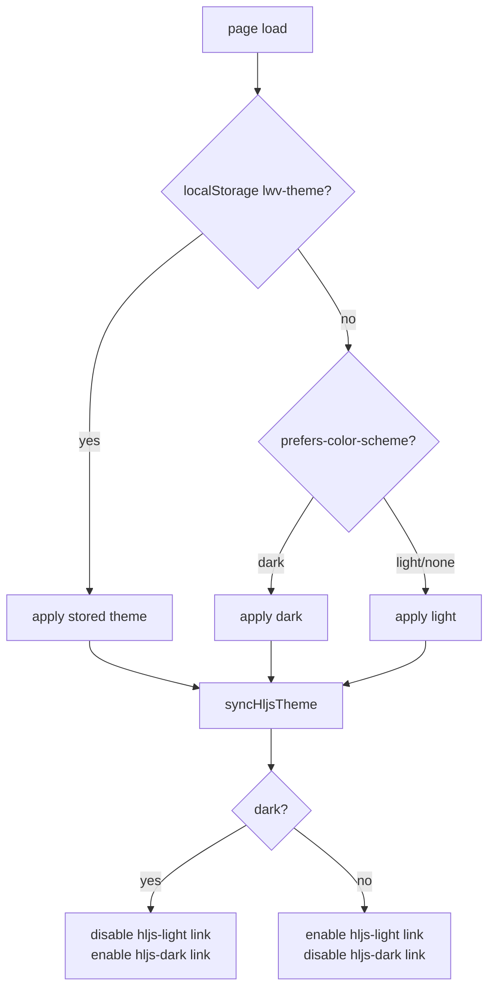

# Theming

The viewer uses CSS custom properties (variables) for all design tokens. A `data-theme` attribute on `<html>` switches between light and dark. The highlight.js CSS is separately toggled to match.

## CSS token system

All color and spacing decisions flow from tokens defined in `:root` and overridden in `:root[data-theme="dark"]`:

```css
:root {
  --bg: #fbfaf7;          /* page background */
  --bg-elev: #ffffff;     /* cards, modals */
  --bg-sidebar: #f4f1ec;  /* sidebar */
  --bg-hover: #ece8e0;    /* hover states */
  --border: #e7e2d8;
  --text: #1c1b1a;
  --text-muted: #6b6961;
  --text-faint: #9a978d;
  --accent: #4a3fb8;      /* links, active states */
  --accent-soft: #ece9ff; /* subtle accent backgrounds */
  --code-bg: #f3efe8;     /* code blocks */
  --warn: #b88500;
  --error: #b73a3a;
  --info: #4a6480;
  --suggest: #4a8060;
}

:root[data-theme="dark"] {
  --bg: #14151a;
  --accent: #9c93ff;      /* lighter purple for dark bg */
  /* ... etc ... */
}
```

The warm beige palette (`#fbfaf7`, `#f4f1ec`) distinguishes the viewer from generic dark-on-white tools.

## Theme switching



`toggleTheme()` flips the attribute, saves to localStorage, calls `syncHljsTheme()`, and calls `rerenderMermaid()` to re-render diagrams with the appropriate mermaid theme (`"dark"` vs `"default"`).

## highlight.js CSS integration

Two `<link>` tags are in `index.html`:

```html
<link id="hljs-light" rel="stylesheet"
  href="https://cdn.jsdelivr.net/npm/highlight.js@11.9.0/styles/github.min.css" />
<link id="hljs-dark" rel="stylesheet"
  href="https://cdn.jsdelivr.net/npm/highlight.js@11.9.0/styles/github-dark.min.css" disabled />
```

`syncHljsTheme()` toggles the `disabled` property:

```js
function syncHljsTheme() {
  const dark = document.documentElement.getAttribute("data-theme") === "dark";
  document.getElementById("hljs-light").disabled = dark;
  document.getElementById("hljs-dark").disabled = !dark;
}
```

Because hljs adds permanent token classes to `<code>` elements (e.g. `hljs-keyword`, `hljs-string`), just swapping the active CSS stylesheet is enough — no re-highlighting needed.

**Code block layout**: the `<pre>` is a transparent wrapper; the `<code class="hljs">` provides its own background, padding, border-radius, and border via CSS rules in `style.css` that override hljs defaults:

```css
.article pre { background: transparent; padding: 0; border: none; }
pre code.hljs {
  border-radius: var(--radius);
  border: 1px solid var(--border);
  padding: 14px 16px;
  display: block;
  overflow-x: auto;
}
```

## `[hidden]` override

A single global rule ensures the HTML `hidden` attribute always beats class-based display rules:

```css
[hidden] { display: none !important; }
```

This prevents show/hide bugs where a class with `display: flex` would override `hidden`.
