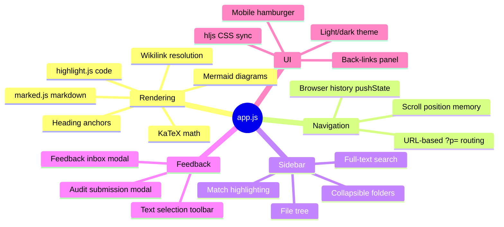
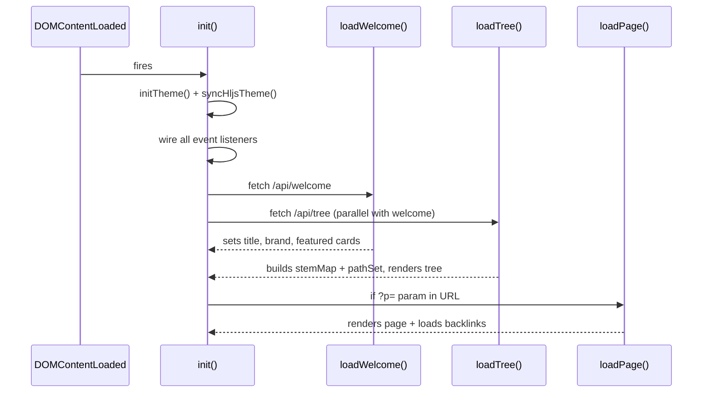

# Frontend Features

The viewer's frontend is a vanilla-JS single-page application with no framework. All logic lives in `app.js` (~900 lines). DOM elements are cached in a top-level `els` object at startup; mutable state lives in a single `state` object.

## State object

```js
const state = {
  welcome, tree,           // loaded at init
  stemMap, pathSet,        // built from tree for wikilink resolution
  currentPath, currentRaw, // the loaded page
  pendingSelection,        // text selected for audit filing
  selectedSeverity,        // audit modal severity
  searchFocusIndex, searchResults, lastSearchQ,
  auditFilter,             // "open" | "all" for inbox filter
};
```

## Feature overview



## Sub-pages

- [[Rendering Pipeline]] — how markdown becomes HTML: preprocess → marked → hljs → KaTeX → mermaid → postprocess
- [[Sidebar Navigation]] — tree rendering, collapsible folders, search with snippet highlighting, scroll memory
- [[Audit Feedback System]] — selection detection, anchor extraction, modal, POST, inbox viewer
- [[Theming]] — CSS custom properties, dark/light toggle, highlight.js CSS swapping
- [[Mobile Support]] — hamburger toggle, sidebar drawer pattern, responsive breakpoint

## Initialization sequence


